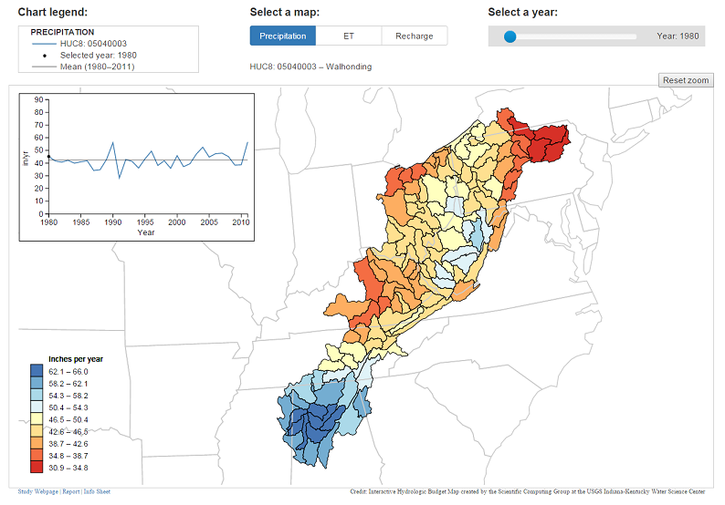

# aquifer-map-d3

A data visualization project using [D3.js] to highlight the results of the following [USGS] hydrologic budget study:

[Hydrologic Budget and Conditions of Permian, Pennsylvanian, and Mississippian aquifers in the Appalachian Plateaus Physiographic Province](http://pubs.usgs.gov/sir/2015/5106/sir20155106.pdf)

Data visualization website - https://jlant.github.io/aquifer-map-d3/  
USGS hydrologic budget study website - http://va.water.usgs.gov/appalachianplateaus/sir2015-5106/

Screenshot:

## Version

1.3

## Features

* Interactive map to query and explore the results of the study
* Contains maps from the [Surface Water Balance (SWB) model] showing precipitation, evapotranspiration, and recharge
* Has a toggle switch to select water budget component of interest
* Includes major watershed overlays that when queried produce, time-series plots of mean annual water budgets summarized on major watersheds
* Has a slider bar to select year of SWB model for display
* Mobile platform compatible

## Additional Study Information

http://va.water.usgs.gov/appalachianplateaus/study.html  
http://va.water.usgs.gov/appalachianplateaus/pdfs/USGS_AppPlatGW_infosheet.pdf

## License
This software is licensed under [CC0 1.0] and is in the [public domain] because it contains materials that originally
came from the [U.S. Geological Survey (USGS)], an agency of the [United States Department of Interior]. For more
information, see the [official USGS copyright policy].

## Disclaimer  

This software is preliminary or provisional and is subject to revision. It is being provided to meet the need for timely
best science. The software has not received final approval by the U.S. Geological Survey (USGS). No warranty, expressed
or implied, is made by the USGS or the U.S. Government as to the functionality of the software and related material nor
shall the fact of release constitute any such warranty. The software is provided on the condition that neither the USGS
nor the U.S. Government shall be held liable for any damages resulting from the authorized or unauthorized use of the
software.

The USGS provides no warranty, expressed or implied, as to the correctness of the furnished software or the suitability
for any purpose. The software has been tested, but as with any complex software, there could be undetected errors. Users
who find errors are requested to report them to the USGS.

References to non-USGS products, trade names, and (or) services are provided for information purposes only and do not
constitute endorsement or warranty, express or implied, by the USGS, U.S. Department of Interior, or U.S. Government, as
to their suitability, content, usefulness, functioning, completeness, or accuracy.

Although this program has been used by the USGS, no warranty, expressed or implied, is made by the USGS or the United
States Government as to the accuracy and functioning of the program and related program material nor shall the fact of
distribution constitute any such warranty, and no responsibility is assumed by the USGS in connection therewith.

This software is provided "AS IS."

## Author(s)

Jeremiah Lant  
jlant@usgs.gov

Justin Boldt  
jboldt@usgs.gov

[public domain]:https://en.wikipedia.org/wiki/Public_domain
[CC0 1.0]:http://creativecommons.org/publicdomain/zero/1.0/
[U.S. Geological Survey]:https://www.usgs.gov/
[USGS]:https://www.usgs.gov/
[U.S. Geological Survey (USGS)]:https://www.usgs.gov/
[USGS Fundamental Science Practices]:https://www2.usgs.gov/fsp/fsp_disclaimers.asp
[United States Department of Interior]:https://www.doi.gov/
[official USGS copyright policy]:http://www.usgs.gov/visual-id/credit_usgs.html#copyright/
[U.S. Geological Survey (USGS) Software User Rights Notice]:http://water.usgs.gov/software/help/notice/

[D3.js]:https://d3js.org/
[Surface Water Balance (SWB) model]:http://pubs.usgs.gov/tm/tm6-a31/tm6a31.pdf
